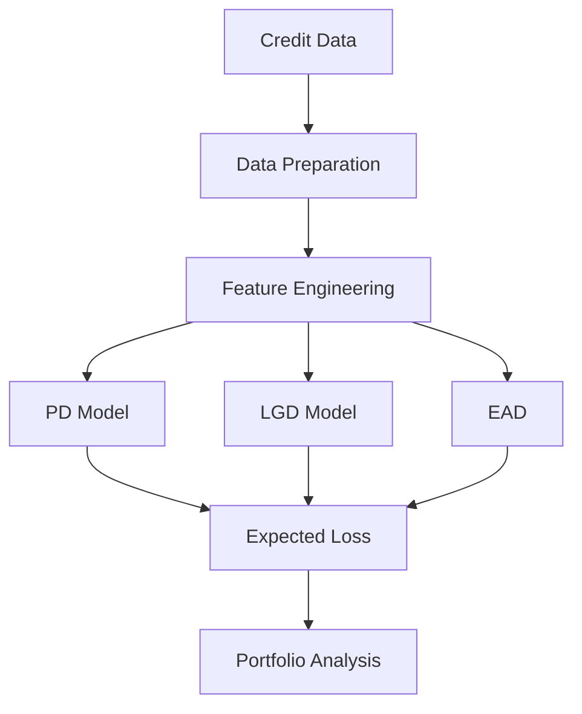

Credit Risk Analytics – PD, LGD, EAD & Expected Loss
Projektübersicht

Dieses Projekt entwickelt eine End-to-End Credit-Risk-Analytics-Pipeline zur Quantifizierung des Kreditrisikos auf Einzelkredit- und Portfolioebene.

Im Mittelpunkt stehen die drei zentralen Risikoparameter:

Probability of Default (PD) – Wahrscheinlichkeit eines Kreditausfalls
Loss Given Default (LGD) – erwarteter Verlustanteil im Falle eines Ausfalls
Exposure at Default (EAD) – erwartetes Exposure zum Zeitpunkt des Ausfalls

Aus diesen Parametern wird anschließend der Expected Loss (EL) berechnet:

Expected Loss = PD × LGD × EAD

Das Projekt kombiniert Databricks, PySpark, Machine Learning und Delta Tables und folgt einer strukturierten Bronze-Silver-Gold-Datenarchitektur.

Projektziele

Ziel des Projekts ist es, einen reproduzierbaren Workflow für die Analyse und Modellierung von Kreditrisiken aufzubauen.

Dabei werden:

Rohdaten in einer Bronze-Schicht verarbeitet
Daten bereinigt und transformiert
analytische Gold-KPIs erstellt
ein PD-Modell zur Ausfallwahrscheinlichkeit entwickelt
ein LGD-Modell zur Verlustquote entwickelt
EAD als Exposure-Größe bestimmt
der Expected Loss auf Kredit- und Portfolioebene berechnet
zentrale Ergebnisse als CSV für Reporting und Dokumentation exportiert
Technologie-Stack
Technologie	Verwendung
Databricks	Entwicklungs- und Ausführungsumgebung
PySpark	Datenverarbeitung und Machine Learning
Spark MLlib	Modellierung von PD und LGD
Delta Lake	Speicherung der Bronze-, Silver- und Gold-Daten
Python	Datenanalyse, Modellierung und Visualisierung
GitHub	Versionskontrolle und Projektdokumentation
Datenarchitektur

Das Projekt verwendet eine klassische Medallion Architecture:

                    Raw Credit Data
                          │
                          ▼
                 ┌─────────────────┐
                 │     BRONZE      │
                 │ Raw / Initial   │
                 │ Data            │
                 └────────┬────────┘
                          │
                          ▼
                 ┌─────────────────┐
                 │     SILVER      │
                 │ Cleaned &       │
                 │ Transformed     │
                 │ Data            │
                 └────────┬────────┘
                          │
                          ▼
                 ┌─────────────────┐
                 │      GOLD       │
                 │ KPI & Analytics │
                 └────────┬────────┘
                          │
                          ▼
              ┌─────────────────────────┐
              │     Credit Risk Model  │
              │                         │
              │  PD → LGD → EAD → EL   │
              └────────────┬────────────┘
                           │
                           ▼
                    Portfolio Risk
                       Analysis
Repository Structure
```text
credit-risk-project/
│
├── README.md
│
├── notebooks/
│   ├── 01_Credit_Risk_bronze
│   ├── 02_Credit_Risk_silver
│   ├── 03_Credit_Risk_gold
│   └── 04_Credit_Risk_Model
│
├── results/
│   ├── expected_loss_results.csv
│   ├── credit_risk_kpi_default_grade.csv
│   ├── credit_risk_kpi_grade.csv
│   ├── credit_risk_kpi_portfolio.csv
│   └── credit_risk_kpi_status.csv
│
├── reports/
│
├── docs/
│   └── methodology.md
│
├── requirements.txt
│
└── .gitignore


1. Data Engineering
Bronze Layer

Die Bronze-Schicht enthält die initial geladenen Kreditdaten.

Notebook:

A. 01_Credit_Risk_bronze

Ziel der Bronze-Schicht ist die strukturierte Speicherung der Rohdaten als Ausgangspunkt für die weitere Verarbeitung.

Silver Layer

In der Silver-Schicht werden die Daten bereinigt, transformiert und für die weitere Analyse vorbereitet.

Notebook:

B. 02_Credit_Risk_silver

Typische Verarbeitungsschritte umfassen:

a. Behandlung fehlender Werte
b. Datentypen und Formatierung
c. Feature Engineering
d. Definition des Default Targets
e. Vorbereitung der Modellvariablen
f. Gold Layer

Die Gold-Schicht enthält aggregierte und analytisch nutzbare Kreditrisiko-KPIs.

Notebook:

C. 03_Credit_Risk_gold

Unter anderem wurden folgende KPI-Tabellen erstellt:

. credit_risk_kpi_default_grade
. credit_risk_kpi_grade
. credit_risk_kpi_portfolio
. credit_risk_kpi_status

Diese Tabellen dienen als Grundlage für Portfolioanalysen und Reporting.

2. Probability of Default (PD)

Die Probability of Default (PD) beschreibt die geschätzte Wahrscheinlichkeit, dass ein Kreditnehmer ausfällt.

Für die PD-Modellierung wurden mehrere Klassifikationsverfahren verglichen:

. Logistic Regression
. Linear SVM
. GBT Classifier
. Random Forest
. Decision Tree
. Multilayer Perceptron
. Naive Bayes

Als zentrale Bewertungsmetrik wurde die ROC-AUC verwendet.

Die Logistic Regression erzielte mit einer ROC-AUC von 0,6895 das beste Validierungsergebnis und wurde daher als finales PD-Modell ausgewählt.

Finales PD-Modell

Logistic Regression
regParam = 0.01
elasticNetParam = 1.0
maxIter = 1000

Für die Modellierung wurde außerdem ein Class Weighting eingesetzt, um die ungleichmäßige Verteilung zwischen Default- und Non-Default-Fällen zu berücksichtigen.

Die kontinuierliche PD wird anschließend für die Expected-Loss-Berechnung verwendet.

3. Loss Given Default (LGD)

Die Loss Given Default (LGD) beschreibt den erwarteten Verlustanteil eines Kredits nach Eintritt eines Defaults.

Für die Modellierung wurden ausschließlich historische Default-Fälle betrachtet.

Die LGD wurde aus historischen Rückzahlungen und Recovery-Werten abgeleitet:

Net Recovery =
Total Recovered Principal
+ Recoveries
- Collection Recovery Fee

Daraus wurde eine historische LGD-Näherung berechnet:

LGD = 1 - Recovery Rate

Die beobachtete LGD lag im Datensatz im Mittel bei rund 59,5 %.

Für die Modellierung wurden mehrere Regressionsverfahren verglichen:

Linear Regression
Random Forest Regression
GBT Regression

Die Linear Regression erzielte das beste Validierungsergebnis:

MAE  = 0.2095
RMSE = 0.2478

Daher wurde die Linear Regression als finales LGD-Modell ausgewählt.

4. Exposure at Default (EAD)

Der Exposure at Default (EAD) beschreibt das erwartete Kreditengagement zum Zeitpunkt eines möglichen Ausfalls.

Da keine vollständige dynamische EAD-Modellierung vorliegt, wird im Projekt vereinfachend das finanzierte Kreditvolumen verwendet:

EAD = funded_amnt

Diese Annahme ermöglicht die Berechnung des Expected Loss auf Einzelkredit- und Portfolioebene.

5. Expected Loss

Der Expected Loss wird aus den drei Risikoparametern berechnet:

EL = PD × LGD × EAD

Dabei gilt:

PD  → Probability of Default
LGD → Loss Given Default
EAD → Exposure at Default

Beispiel:

PD  = 20 %
LGD = 60 %
EAD = 10,000 €

EL = 0.20 × 0.60 × 10,000 €
   = 1,200 €

Für jeden Kredit werden die Werte PD, LGD, EAD und Expected_Loss berechnet.

Die Ergebnisse werden in folgender Datei bereitgestellt:

results/expected_loss_results.csv
6. Portfolio Results

Die Portfolioanalyse liefert folgende zentrale Ergebnisse:

KPI	Ergebnis
Total EAD	€85.80 Mio.
Total Expected Loss	€24.56 Mio.
Expected Loss Rate	28.63 %
Average PD	46.22 %
Average LGD	56.12 %
Average Expected Loss	€3,082.70

Die Expected-Loss-Quote von 28,63 % beschreibt den erwarteten Verlust im Verhältnis zum gesamten Exposure des analysierten Portfolios.

7. Results

Die wichtigsten Ergebnisse werden als CSV-Dateien im Repository bereitgestellt:

```text
results/
│
├── expected_loss_results.csv
│
├── credit_risk_kpi_default_grade.csv
├── credit_risk_kpi_grade.csv
├── credit_risk_kpi_portfolio.csv
└── credit_risk_kpi_status.csv

Die Delta Tables in Databricks stellen dabei die zentrale Datenbasis dar. Die CSV-Dateien dienen primär der Weitergabe, Dokumentation und Visualisierung der aggregierten Ergebnisse.

8. Modeling Approach

Der gesamte Modellierungsprozess folgt der Struktur:



Die Modellierung verwendet separate Trainings- und Validierungsdaten. Für das finale PD-Modell wurde der Testdatensatz erst nach der Modellauswahl zur abschließenden Evaluation verwendet.

9. Limitations

Das Projekt stellt eine analytische und vereinfachte Credit-Risk-Modellierung dar und ist nicht als regulatorisches IFRS-9- oder Basel-Modell zu verstehen.

Wichtige Einschränkungen sind:

Die LGD basiert auf einer vereinfachten historischen Recovery-Näherung.
Post-Default-Variablen werden zur Konstruktion des LGD-Ziels verwendet und dürfen nicht als PD-Features eingesetzt werden.
Die EAD wird vereinfachend durch funded_amnt approximiert.
Eine zeitliche Diskontierung von Recovery Cashflows ist nicht enthalten.
Eine explizite PD-Kalibrierung wurde nicht durchgeführt.
Das LGD-Modell verfügt über keine separate Holdout-Testmenge.
Die Ergebnisse sind daher primär für analytische und prototypische Zwecke geeignet.
10. Future Improvements

**Mögliche Erweiterungen des Projekts sind**:

PD Calibration
Probability of Default Binning
Scorecard Development
Weight of Evidence (WoE)
Information Value (IV)
Hyperparameter Optimization
Cross-Validation
Separate LGD Test Dataset
Dynamisches EAD-Modell
Discounted Recovery Cashflows
Vintage Analysis
Population Stability Index (PSI)
Model Monitoring
Explainability mit SHAP
interaktives Credit-Risk-Dashboard
11. Conclusion

Das Projekt zeigt eine vollständige Credit-Risk-Pipeline von der Datenaufbereitung bis zur Expected-Loss-Berechnung.

Die wesentlichen Komponenten sind:

Data Engineering → PD → LGD → EAD → Expected Loss → Portfolio Risk Analysis

Als finales PD-Modell wurde eine Logistic Regression ausgewählt. Für die LGD-Modellierung wurde eine Linear Regression verwendet.

Die resultierenden Kreditrisikokennzahlen ermöglichen eine quantitative Bewertung des erwarteten Verlusts sowohl auf Einzelkredit- als auch auf Portfolioebene.
